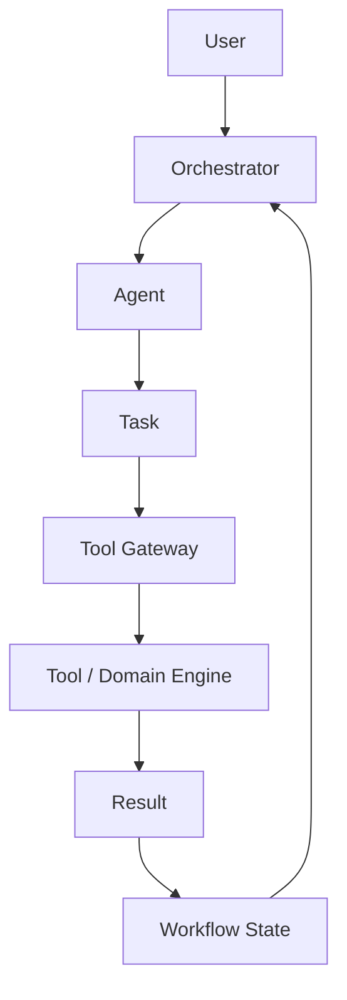

# BIOrch Architecture

## Purpose
BIOrch is an agent orchestration platform specifically designed for Business Intelligence (BI) and software-engineering tasks. It serves as the intelligent coordinator that maps user intents to specialized BI analysis agents.

## Core Layers
The architecture follows a strict 5-layer separation:

1. **User / Experience**
   The interface layer (CLI, Web UI, Chat, API) where the user interacts with the system.

2. **Orchestration**
   The coordination layer responsible for:
   - Planning and routing
   - Dependency management
   - State and context maintenance
   - Failure recovery and retries
   - Parallel execution
   - Termination conditions

3. **Agents**
   Specialized actors with narrow responsibilities, such as:
   - `TableauAgent`
   - `PowerBIAgent`
   - `RepositoryAgent`
   - `ReviewAgent`
   - `ReportAgent`

4. **Capabilities / Tools**
   Small, deterministic operations that agents can request (e.g., `read_file`, `list_directory`, `run_tableau_parser`).
   **Important:** This layer contains the **Tool Gateway**, which acts as the strict security boundary. Agents do not execute tools directly; they request execution through the gateway, which enforces authentication, authorization, and policy.

5. **Domain Engines**
   The underlying domain-specific parsers and tools.
   - **TabUI:** Tableau metadata extraction and analysis.
   - **PBIParser:** Power BI metadata extraction and analysis.
   *Note: BIOrch does not absorb the source code of TabUI or PBIParser. It integrates with them via adapters.*

## Target Conceptual Flow

## Architectural Principles
- **Framework-Neutral Architecture:** The architecture is built around internal structured contracts (Task, Agent, Result, Workflow, Tool). Any framework (CrewAI, LangGraph, etc.) will act as an adapter underneath these contracts to avoid vendor lock-in.
- **Structured Communication:** Agents do not communicate through unstructured text. All communication is strictly governed by JSON schema contracts.
- **Narrow Responsibilities:** Agents have specialized, narrow capabilities.
- **Narrow Permissions:** Tools are explicitly allowlisted per agent via the Tool Gateway.
- **Deterministic First:** The system will prove deterministic orchestration workflows before adopting autonomous LLM-based planning.
- **Human in the Loop:** Sensitive operations (e.g., writes, network access) require human approval.
